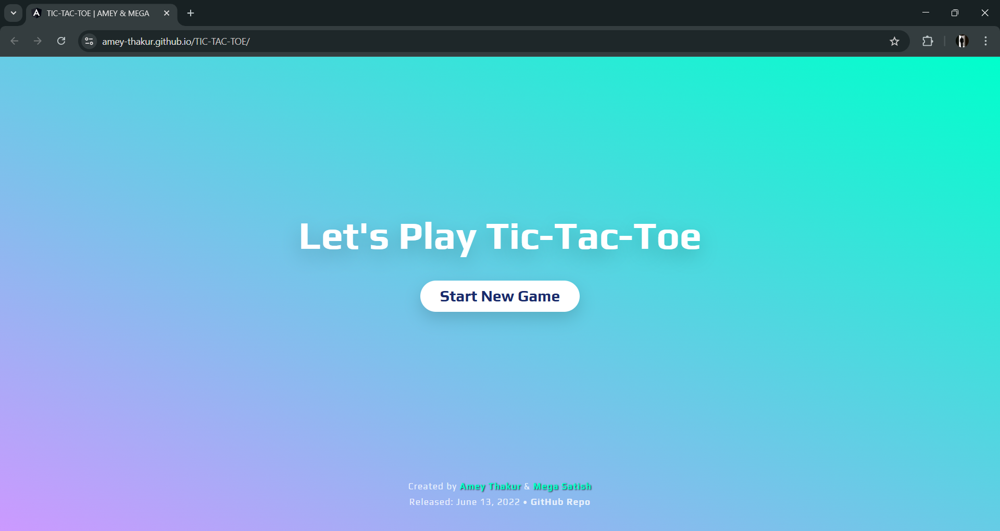
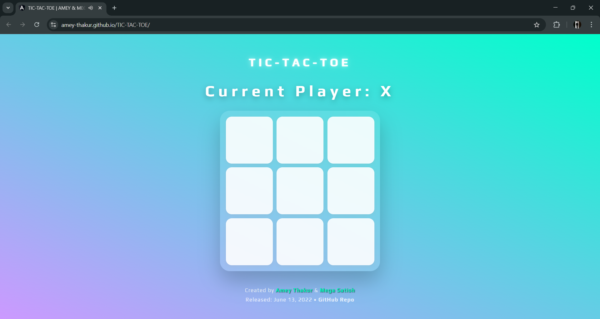
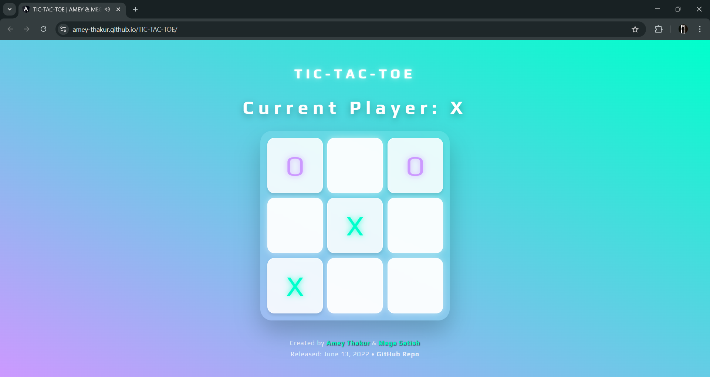
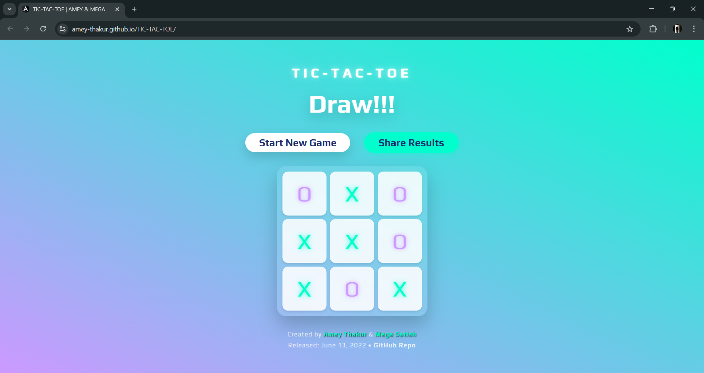
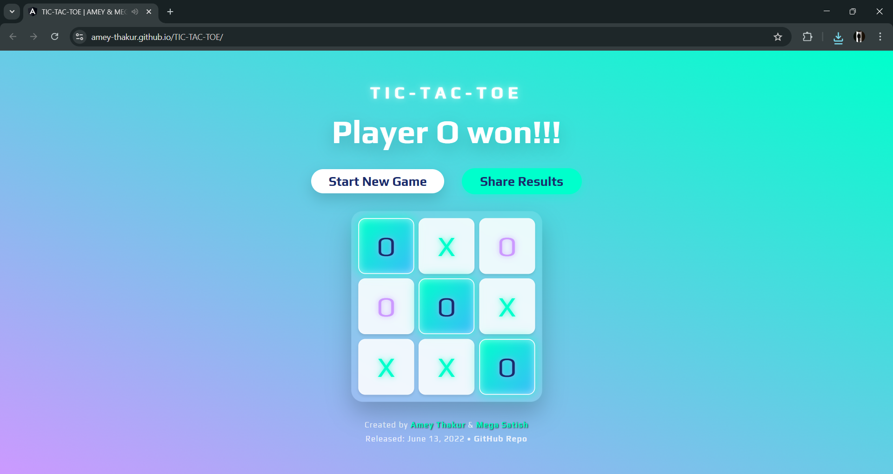
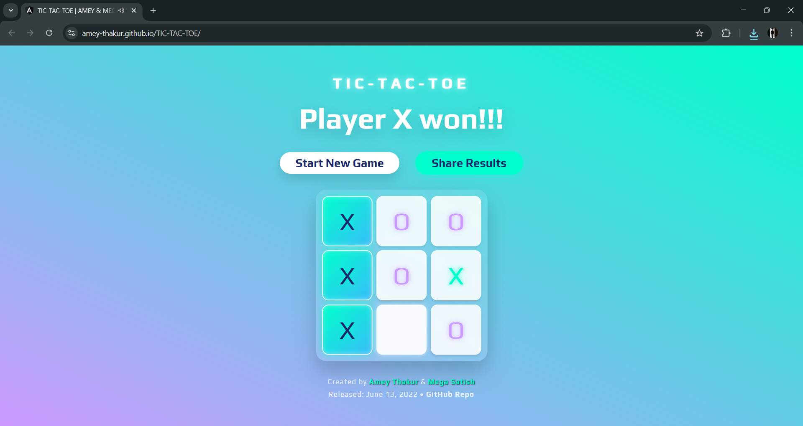
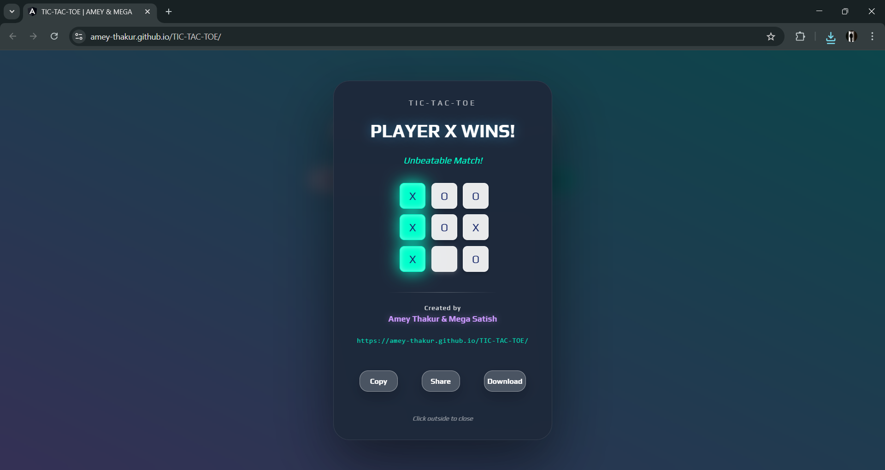
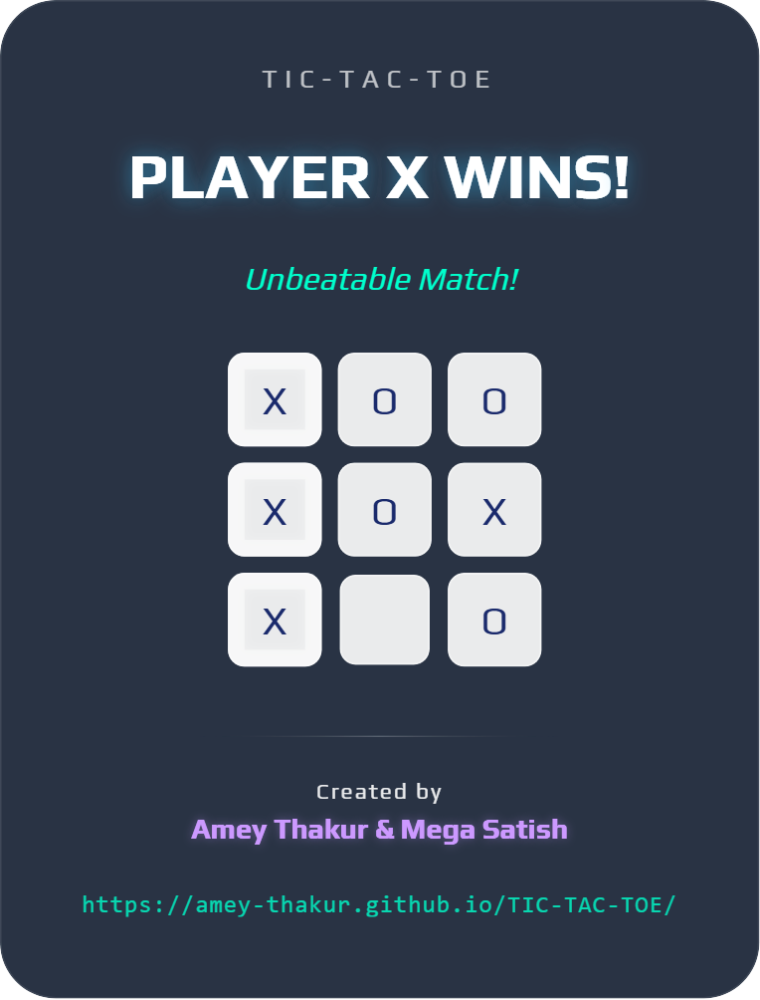
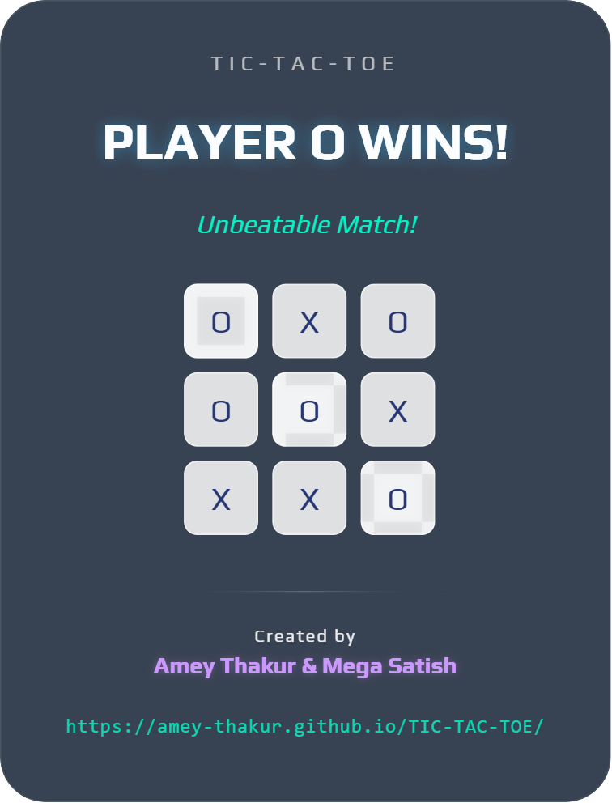
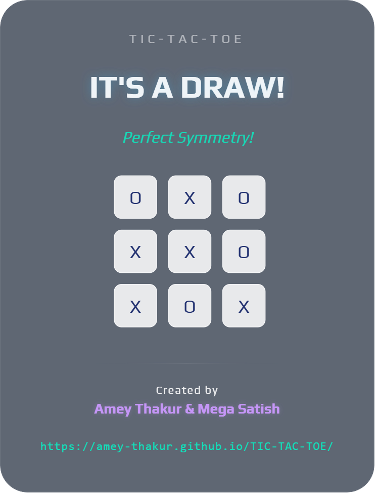

<div align="center">

  <a name="readme-top"></a>
  # Tic Tac Toe (Angular Framework)

  [](LICENSE)
  
  [](https://github.com/Amey-Thakur/TIC-TAC-TOE-ANGULAR-FRAMEWORK)
  [](https://github.com/Amey-Thakur/TIC-TAC-TOE-ANGULAR-FRAMEWORK)

  A high-performance, tactile game implementation built with Angular 21, featuring autonomous state management via Signals and procedural audio synthesis for an advanced Human-Machine Interaction (HMI) experience.

  **[Source Code](Source%20Code/TicTacToe/)** &nbsp;·&nbsp; **[Video Demo](https://youtu.be/zCKgLImSjeo)** &nbsp;·&nbsp; **[Live Demo](https://amey-thakur.github.io/TIC-TAC-TOE/)**

</div>

---

<div align="center">

  [Authors](#authors) &nbsp;·&nbsp; [Overview](#overview) &nbsp;·&nbsp; [Features](#features) &nbsp;·&nbsp; [Structure](#project-structure) &nbsp;·&nbsp; [Results](#results) &nbsp;·&nbsp; [Quick Start](#quick-start) &nbsp;·&nbsp; [Usage Guidelines](#usage-guidelines) &nbsp;·&nbsp; [License](#license) &nbsp;·&nbsp; [About](#about-this-repository) &nbsp;·&nbsp; [Acknowledgments](#acknowledgments)

</div>

---

<!-- AUTHORS -->
<div align="center">

  <a name="authors"></a>
  ## Authors

| <a href="https://github.com/Amey-Thakur"></a><br>[**Amey Thakur**](https://github.com/Amey-Thakur)<br><br>[](https://orcid.org/0000-0001-5644-1575) | <a href="https://github.com/msatmod"></a><br>[**Mega Satish**](https://github.com/msatmod)<br><br>[](https://orcid.org/0000-0002-1844-9557) |
| :---: | :---: |

</div>

> [!IMPORTANT]
> ### 🤝🏻 Special Acknowledgement
> *Special thanks to **[Mega Satish](https://github.com/msatmod)** for her meaningful contributions, guidance, and support that helped shape this work.*

---

<!-- OVERVIEW -->
<a name="overview"></a>
## Overview

**Tic Tac Toe (Angular Framework)** is a tactile interactive system engineered to redefine classic logic through a responsive, glassmorphic interface. By bridging the gap between traditional board games and sensory-rich digital environments, this repository provides a foundational study into modern Angular architecture and Human-Machine Interaction (HMI).

The application serves as a digital exploration of reactive state management and tactile transitions, brought into a modern context via the latest **Angular 21** and **Signals**, enabling high-performance game orchestration directly within the browser environment.

### Engineering Heuristics
The interaction model is governed by strict **computational design patterns** ensuring fidelity and responsiveness:
*   **Reactive Orchestration**: The system utilizes **Angular Signals** for granular reactivity, ensuring O(1) change detection and eliminating redundant DOM reconciliation during intensive gameplay.
*   **Procedural Audio**: Beyond visual cues, the system integrates a **Web Audio API engine** that dynamically generates synthesized waveforms, reinforcing the goal-driven narrative of every move.
*   **Tactile Physics**: Layout and interaction transitions are governed by complex `cubic-bezier` curves and rotate-aware CSS transformations, providing a physical, elastic feel to the board.

> [!TIP]
> **Sensory Precision Integration**
>
> To maximize user engagement, the system employs a **multi-sensory validation system**. **Visual victory vectors** (Signaled by the High-Contrast Victory State) and **procedural resonators** strictly couple interaction goals with state changes. This ensures the user's mental model is constantly synchronized with the underlying game trajectory.

---

<!-- FEATURES -->
<a name="features"></a>
## Features

| Feature | Description |
|---------|-------------|
| **Autonomous State** | Implements **Angular Signals** (`signal`, `computed`, `effect`) for modern reactive orchestration. |
| **Procedural Audio** | Custom **Web Audio Synthesizer** generating real-time waveforms for tactile sensory feedback. |
| **Tactile UX** | **Glassmorphic Design** with responsive hover expansions and 3D board transformations. |
| **Pristine Archival** | A refined structure with eliminated clutter, ensuring a **"Pure Source"** study environment. |
| **High-Fidelity Sharing** | Integrated **Result Card Engine** using `html2canvas` for responsive post-game snapshots. |
| **Hardened Logic** | Advanced **Guard Clauses** and interaction locks to prevent state corruption post-victory. |
| **Automated Ops** | Modern **GitHub Actions Workflow** for deterministic PWA deployment to GitHub Pages. |
| **Structural Clarity** | In-depth and detailed scholarly comments integrated throughout the codebase for transparent logic study. |

> [!NOTE]
> ### Interactive Polish: The Glass Board
> We have engineered a **Logic-Driven Animation Manager** that calibrates layout shifts across multiple vectors to simulate fluid human-like movement. The visual language focuses on the "Glass Board" aesthetic, ensuring maximum focus on the interactive game trajectory.

### Tech Stack
- **Framework**: **Angular 21.1.2** (Standalone Architecture)
- **Logic**: **Signals-based Orchestration** (state, computation, effects)
- **Audio**: **Web Audio API** (Procedural Sine/Square Tone Synthesis)
- **Visuals**: **CSS3 Glassmorphism** & backdrop filters
- **Build System**: **Angular CLI + esbuild** (Optimized Bundling)
- **Automation**: **GitHub Actions** (CI/CD Deployment Pipeline)
- **Hosting**: GitHub Pages (Subdirectory Optimized)

---

<!-- STRUCTURE -->
<a name="project-structure"></a>
## Project Structure

```python
TIC-TAC-TOE-ANGULAR-FRAMEWORK/
│
├── .github/ workflows/              # DevOps Automation
│   └── deploy.yml                   # GitHub Pages Deployment
│
├── docs/                            # Documentation Layer
│   └── SPECIFICATION.md             # Technical Architecture
│
├── Mega/                            # Attribution Assets
│   ├── Filly.jpg                    # Companion (Filly)
│   └── Mega.png                     # Profile Image (Mega Satish)
│
├── screenshots/                     # Visual Gallery
│   ├── 01-loading-screen.png        # System Boot
│   ├── 04-game-play.png             # Kinetic UI
│   ├── 07-winner-x.png              # System Log: Goal Achieved
│   └── 09-share-card-x-win.png      # High-Fidelity Capture
│
├── Source Code/                     # Primary Application Layer
│   └── TicTacToe/
│       ├── src/                     # Standalone Logic
│       │   ├── app/                 # Component Ecosystem
│       │   │   ├── board/           # Square Components
│       │   │   ├── game/            # Game Orchestrator (Signals)
│       │   │   ├── not-found/       # Error Handling Layer
│       │   │   └── sound.service.ts # Procedural Audio Engine
│       │   ├── assets/              # Static Resources
│       │   ├── index.html           # Application Entrance
│       │   └── main.ts              # System Bootstrapper
│       ├── angular.json             # Build Architecture
│       └── package.json             # Dependency Manifest
│
├── SECURITY.md                      # Security Protocols
├── social_preview.html              # Social Preview Branding
├── CITATION.cff                     # Project Citation Manifest
├── codemeta.json                    # Metadata Standard
├── LICENSE                          # MIT License
└── README.md                        # Project Entrance
```

---

<a name="results"></a>
## Results

<div align="center">
  <b>System Boot: Sensory Loading</b>
  <br>
  <i>Initial system state with optimized aesthetics and synchronized brand identity.</i>
  <br><br>
  
  <br><br><br>
 
  <b>Board Initialization: Modern Homepage</b>
  <br>
  <i>Clean, glassmorphic entrance portal for the interactive grid.</i>
  <br><br>
  
  <br><br><br>
 
  <b>Game Start: Reactive Ready</b>
  <br>
  <i>Logical state prepared for high-fidelity interactive orchestration.</i>
  <br><br>
  
  <br><br><br>

  <b>Tactile Feedback: Kinetic Interaction</b>
  <br>
  <i>Real-time move injection with visual expansion and procedural audio feedback.</i>
  <br><br>
  
  <br><br><br>

  <b>Operational Equilibrium: Draw State</b>
  <br>
  <i>System-wide state locking triggered upon total grid saturation without victory.</i>
  <br><br>
  
  <br><br><br>

  <b>System Log: Victory O</b>
  <br>
  <i>Automated high-contrast celebration for Player O victory.</i>
  <br><br>
  
  <br><br><br>

  <b>System Log: Victory X</b>
  <br>
  <i>Automated high-contrast celebration for Player X victory.</i>
  <br><br>
  
  <br><br><br>

  <b>Result Aggregation: Share Result</b>
  <br>
  <i>Dynamic overlay for post-game result review and social injection.</i>
  <br><br>
  
  <br><br><br>

  <b>Refined Snapshots: High-Fidelity Cards</b>
  <br>
  <i>Synthesized result cards optimized for social distribution and archival.</i>
  <br><br>
  
  
  <br><br>
  
</div>

---

<!-- QUICK START -->
<a name="quick-start"></a>
## Quick Start

### 1. Prerequisites
- **Node.js 20+**: Required for modern Angular build and runtime. [Download Node.js](https://nodejs.org/)
- **Angular CLI**: Install via `npm install -g @angular/cli`.
- **Git**: For version control and cloning. [Download Git](https://git-scm.com/downloads)

> [!WARNING]
> **Subdirectory Deployment Guard**
>
> When deploying to GitHub Pages, ensure the build includes the `--base-href /TIC-TAC-TOE/` flag to correctly resolve asset pathing within the subdirectory environment. This is handled automatically by the integrated GitHub Actions workflow.

### 2. Installation & Setup

#### Step 1: Clone the Repository
Open your terminal and clone the repository:
```bash
git clone https://github.com/Amey-Thakur/TIC-TAC-TOE-ANGULAR-FRAMEWORK.git
cd TIC-TAC-TOE-ANGULAR-FRAMEWORK
```

#### Step 2: Navigate to Source
Access the primary Angular application layer:
```bash
cd "Source Code/TicTacToe"
```

#### Step 3: Synchronize Environment
Install core dependencies and logic engines:
```bash
npm install
```

### 3. Execution
Launch the primary reactive development server:

```bash
ng serve
```

---

<!-- USAGE GUIDELINES -->
<a name="usage-guidelines"></a>
## Usage Guidelines

This repository is openly shared to support learning and knowledge exchange across the engineering community.

**For Students**  
Use this project as reference material for understanding **Angular Signals**, **Standalone Component Architecture**, and **Procedural Audio Synthesis**. The source code is available for study to facilitate high-performance interactive development.

**For Educators**  
This project may serve as a practical lab example or supplementary teaching resource for **Web Frameworks**, **Human-Machine Interaction**, and **Interactive System Design** courses.

**For Researchers**  
The documentation and architectural approach may provide insights into **systematic project archiving**, **esbuild-optimized bundling**, and **sensory feedback loops in modern SPAs**.

---

<!-- LICENSE -->
<a name="license"></a>
## License

This repository and all its creative and technical assets are made available under the **MIT License**. See the [LICENSE](LICENSE) file for complete terms.

> [!NOTE]
> **Summary**: You are free to share and adapt this content for any purpose, even commercially, as long as you provide appropriate attribution to the original authors.

Copyright © 2022 Amey Thakur & Mega Satish

---

<!-- ABOUT -->
<a name="about-this-repository"></a>
## About This Repository

**Created & Maintained by**: [Amey Thakur](https://github.com/Amey-Thakur) & [Mega Satish](https://github.com/msatmod)

This project features **Tic Tac Toe (Angular Framework)**, a sensory-rich tactile game. It represents a personal exploration into **Angular**-based state orchestration and high-performance interactive design.

**Connect:** [GitHub](https://github.com/Amey-Thakur) &nbsp;·&nbsp; [LinkedIn](https://www.linkedin.com/in/amey-thakur) &nbsp;·&nbsp; [ORCID](https://orcid.org/0000-0001-5644-1575)

### Acknowledgments

Grateful acknowledgment to [**Mega Satish**](https://github.com/msatmod) for her exceptional collaboration and partnership during the development of this Tic-Tac-Toe Technical Project. Her constant support, technical clarity, and dedication to software quality were instrumental in achieving the system's functional objectives. Learning alongside her was a transformative experience; her thoughtful approach to problem-solving and steady encouragement turned complex requirements into meaningful learning moments. This work reflects the growth and insights gained from our side-by-side journey. Thank you, Mega, for everything you shared and taught along the way.

Special thanks to the **ment mentors and peers** whose encouragement, discussions, and support contributed meaningfully to this learning experience.

---

<div align="center">

  [↑ Back to Top](#readme-top)

  [Authors](#authors) &nbsp;·&nbsp; [Overview](#overview) &nbsp;·&nbsp; [Features](#features) &nbsp;·&nbsp; [Structure](#project-structure) &nbsp;·&nbsp; [Results](#results) &nbsp;·&nbsp; [Quick Start](#quick-start) &nbsp;·&nbsp; [Usage Guidelines](#usage-guidelines) &nbsp;·&nbsp; [License](#license) &nbsp;·&nbsp; [About](#about-this-repository) &nbsp;·&nbsp; [Acknowledgments](#acknowledgments)

  <br>

  🅰️ **[Tic Tac Toe (Angular Framework)](https://amey-thakur.github.io/TIC-TAC-TOE/)**

  ---

  ### 🎓 [Computer Engineering Repository](https://github.com/Amey-Thakur/COMPUTER-ENGINEERING)

  **Computer Engineering (B.E.) - University of Mumbai**

  *Semester-wise curriculum, laboratories, projects, and academic notes.*

</div>
