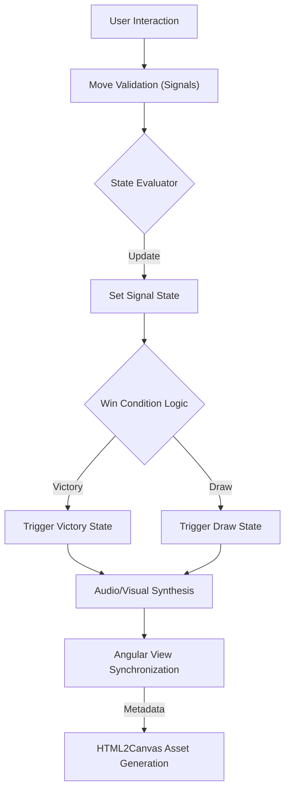

# Technical Specification: Tic Tac Toe (Angular Framework)

## Architectural Overview

**Tic Tac Toe (Angular Framework)** is a high-performance game architecture designed to orchestrate and evaluate grid logic utilizing standalone component patterns and reactive state signals. The application serves as a digital study into Angular 21's Signal API, granular change detection, and procedural audio synthesis, brought into a modern context via the Web Audio API and CSS3 physics.

### Data Logic Flow

---

## Technical Implementations

### 1. Component Architecture
-   **Core Interface**: Built on **Angular 21.1.2** with **Standalone Components**, enabling the execution of modular UI logic natively within the framework's esbuild-optimized environment.
-   **State Topology**: Implements an autonomous state architecture using **Signals** (`signal`, `computed`, `effect`) for O(1) reactive synchronization across the grid.

### 2. Logic & Interactions
-   **Kinetic Design**: Uses physics-aware CSS3 transformations and `cubic-bezier` timing functions to perform real-time layout expansions and hover-aware rotations.
-   **Sound Engineering**: Provides a multi-sensory feedback loop using a **Web Audio API** engine to generate procedural sine and square waveforms, reinforcing user moves and victory events.
-   **Result Archiving**: Event-driven capture system using `html2canvas` to synthesize high-fidelity result cards for archival and social distribution.

### 3. Deployment Pipeline
-   **Build Process**: The project uses **Angular CLI + esbuild** to compile and tree-shake the application, optimizing assets for production deployment with minimal footprint.
-   **CI/CD**: **GitHub Actions** handles the deployment process, injecting the correct `base-href` and syncing static assets to **GitHub Pages**.

---

## Technical Prerequisites

-   **Runtime**: Modern browser with full support for **Signals** and **Web Audio API**.
-   **Development**: Node.js 20+ with `@angular/cli` installed globally.

---

*Technical Specification | Angular | Version 1.0*
